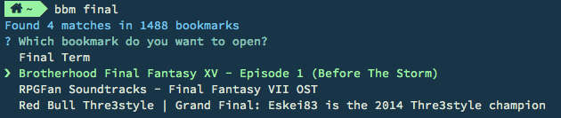

# Browser Bookmark Manager

[](https://david-dm.org/dj-hedgehog/browser-bookmark-manager)
[](https://www.npmjs.com/package/browser-bookmark-manager)
[](https://www.npmjs.com/package/browser-bookmark-manager)

A CLI to help you (fuzzily) find and manage your browser bookmarks.



## Installation

Via NPM:
```
npm install -g browser-bookmark-manager
```

## Usage

```
bbm <searchterm>
```

### Options


```
-b, --browser <browsername>
```
Searches for bookmarks on this browser. Currently only Google Chrome and Firefox are supported

Default: `chrome`


```
-p, --profile <profilename>
```
Search for bookmarks using this profile.

Default: `Default`

## Browser Support

- [x] Google Chrome
- [x] Firefox
- [ ] Opera
- [ ] Safari
- [ ] Microsoft Edge

## OS Support

- [x] OS X
- [x] Windows
- [ ] Linux

## To-Do

- [ ] Linux-Support
- [ ] Delete bookmarks
- [ ] * Any ideas ?*
